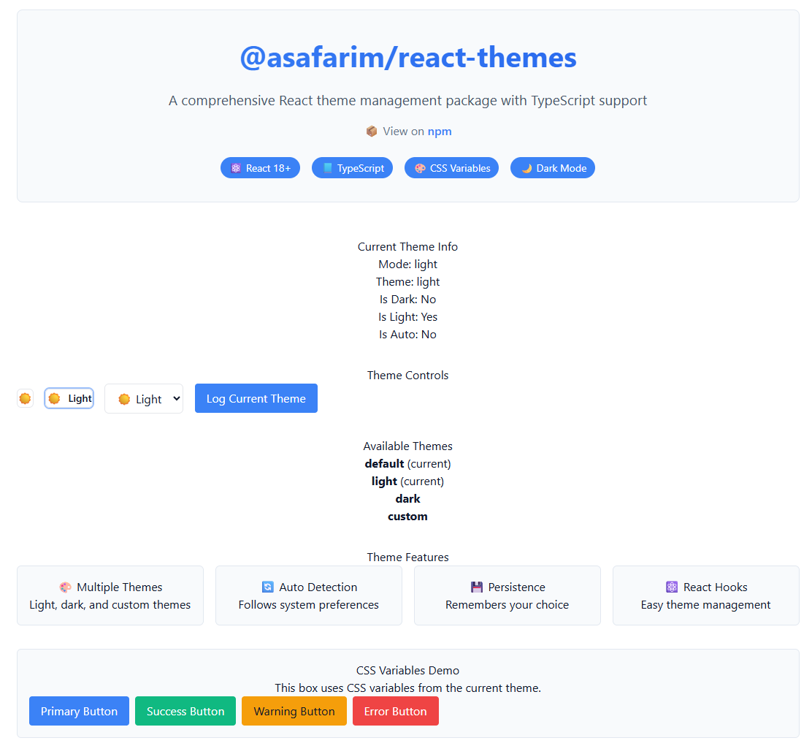
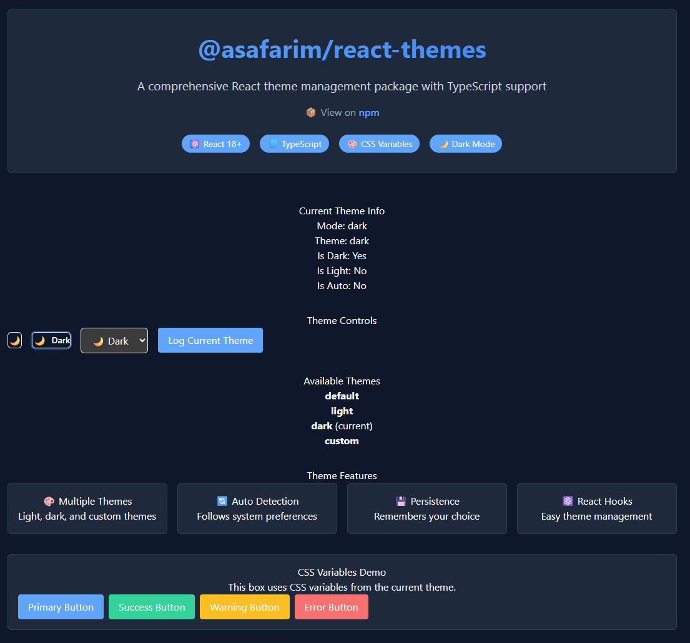

# @asafarim/react-themes

A comprehensive theme management system for React applications with automatic dark/light mode detection, custom theme creation, and smooth transitions.


## 📸 Preview

Experience the theme system in action with our **[Live Interactive Demo](https://bibliography.asafarim.com/react-themes/demo)**

### 🎯 Demo Showcases

The live demo demonstrates all package capabilities:

- **🎨 Theme Switching**: Real-time theme transitions between light, dark, and auto modes
- **🔧 Component Gallery**: All built-in components (ThemeToggle, ThemeSelector) in action
- **📱 Responsive Design**: How themes adapt across different screen sizes
- **🎪 CSS Variables**: Live CSS variable updates and their effects
- **⚡ Performance**: Smooth animations and transitions
- **♿ Accessibility**: Keyboard navigation and screen reader support

<table>
  <tr>
    <td align="center">
      
      <br/>
      <em>Light Theme - Clean and Modern</em>
    </td>
    <td align="center">
      
      <br/>
      <em>Dark Theme - Elegant and Eye-friendly</em>
    </td>
  </tr>
</table>

### 🚀 Try It Live

Visit **[bibliography.asafarim.com/react-themes/demo](https://bibliography.asafarim.com/react-themes/demo)** to:

1. **Interactive Testing**: Toggle between themes and see instant changes
2. **Code Examples**: View implementation examples for each feature
3. **Performance Metrics**: See how fast theme switching works
4. **Integration Examples**: Real-world usage with other components
5. **Customization Demo**: Examples of custom theme creation
6. **Browser Compatibility**: Test across different browsers and devices

## ✨ Features

### 🌓 **Smart Theme Management**

- **Auto Detection**: Automatically detects and follows system dark/light mode preferences
- **Manual Override**: Users can manually select their preferred theme mode
- **Persistence**: Remembers user choice across browser sessions using localStorage
- **Real-time Updates**: Instantly responds to system theme changes

### 🎨 **Advanced Theming System**

- **Built-in Themes**: Professionally designed light and dark themes out of the box
- **Custom Themes**: Create unlimited custom themes with full control over colors, spacing, and typography
- **Theme Merging**: Easily extend existing themes with custom properties
- **CSS Variables**: Automatic injection of CSS custom properties for seamless styling

### ⚡ **Performance & User Experience**

- **Smooth Transitions**: Beautiful, configurable transitions between theme changes
- **Zero Flicker**: Prevents flash of unstyled content during theme initialization
- **Lightweight**: Minimal bundle size impact (~8KB gzipped)
- **Tree Shakeable**: Import only what you need

### 🔧 **Developer Experience**

- **TypeScript First**: Full TypeScript support with comprehensive type definitions
- **React 18+ Ready**: Optimized for latest React features including concurrent rendering
- **Hooks API**: Intuitive React hooks for theme management
- **Component Library**: Pre-built, accessible components for common use cases

### 🎯 **Integration & Compatibility**

- **Framework Agnostic**: Works with any React-based framework (Next.js, Gatsby, CRA, Vite)
- **CSS-in-JS Compatible**: Works with styled-components, emotion, and other CSS-in-JS libraries
- **Tailwind Ready**: Seamlessly integrates with Tailwind CSS through CSS variables
- **Server-Side Rendering**: Full SSR support with proper hydration handling

### ♿ **Accessibility & Standards**

- **WCAG Compliant**: Meets Web Content Accessibility Guidelines
- **Keyboard Navigation**: Full keyboard support for all interactive elements
- **Screen Reader Support**: Proper ARIA labels and announcements
- **High Contrast**: Ensures sufficient color contrast ratios in all themes
- **Reduced Motion**: Respects user's motion preferences

## 📦 Installation

```bash
npm install @asafarim/react-themes
# or
yarn add @asafarim/react-themes
# or
pnpm add @asafarim/react-themes
```

## 🚀 Quick Start

### 1. Wrap your app with ThemeProvider

```tsx
import React from 'react';
import { ThemeProvider } from '@asafarim/react-themes';
import '@asafarim/react-themes/styles.css'; // Optional base styles

function App() {
  return (
    <ThemeProvider defaultMode="auto" persistMode={true}>
      <YourAppContent />
    </ThemeProvider>
  );
}
```

### 2. Use the theme in your components

```tsx
import React from 'react';
import { useTheme, ThemeToggle } from '@asafarim/react-themes';

function MyComponent() {
  const { mode, currentTheme, toggleMode } = useTheme();

  return (
    <div>
      <h1>Current mode: {mode}</h1>
      <ThemeToggle />
      {/* Your component content */}
    </div>
  );
}
```

## 🎯 Use Cases & Examples

### 📚 **Real-World Applications**

Our **[Live Demo](https://bibliography.asafarim.com/react-themes/demo)** showcases these practical implementations:

#### 🌐 **Web Applications**

```tsx
// E-commerce dashboard with theme switching
import { ThemeProvider, ThemeToggle } from '@asafarim/react-themes';

function EcommerceDashboard() {
  return (
    <ThemeProvider defaultMode="auto" persistMode={true}>
      <header className="dashboard-header">
        <h1>Sales Dashboard</h1>
        <ThemeToggle size="sm" showLabels={true} />
      </header>
      <main className="dashboard-content">
        {/* Dashboard content adapts automatically */}
      </main>
    </ThemeProvider>
  );
}
```

#### 📱 **Mobile-First Design**

```css
/* Responsive design that adapts to theme */
.mobile-card {
  background: var(--theme-color-background-secondary);
  border: 1px solid var(--theme-color-border);
  padding: var(--theme-spacing-md);
  border-radius: var(--theme-radius-lg);
  
  /* Automatic dark mode styling */
  box-shadow: var(--theme-shadow-sm);
  transition: var(--theme-transition-normal);
}
```

#### 🎨 **Design Systems**

```tsx
// Integration with component libraries
import { Button, Card } from 'your-ui-library';
import { useTheme } from '@asafarim/react-themes';

function ThemedComponents() {
  const { currentTheme } = useTheme();
  
  return (
    <Card 
      style={{ 
        backgroundColor: currentTheme.colors.background,
        color: currentTheme.colors.text 
      }}
    >
      <Button variant={currentTheme.mode === 'dark' ? 'outlined' : 'filled'}>
        Themed Button
      </Button>
    </Card>
  );
}
```

### 🔄 **Advanced Patterns**

#### 🎪 **Dynamic Theme Loading**

```tsx
// Load themes dynamically based on user preferences
import { createTheme, useTheme } from '@asafarim/react-themes';

function DynamicThemeLoader() {
  const { setTheme } = useTheme();
  
  const loadUserTheme = async (userId: string) => {
    const userPrefs = await fetch(`/api/users/${userId}/theme`);
    const themeData = await userPrefs.json();
    
    const customTheme = createTheme(themeData);
    setTheme(customTheme);
  };
  
  return <div>Loading personalized theme...</div>;
}
```

#### 🏢 **Multi-Brand Applications**

```tsx
// Switch between different brand themes
const brandThemes = {
  corporate: createTheme(lightTheme, {
    name: 'corporate',
    colors: { primary: '#0066cc', secondary: '#004499' }
  }),
  creative: createTheme(darkTheme, {
    name: 'creative', 
    colors: { primary: '#ff6b6b', secondary: '#4ecdc4' }
  })
};

<ThemeProvider customThemes={brandThemes}>
  <BrandSwitcher />
</ThemeProvider>
```

## 📖 API Reference

### 🏗️ ThemeProvider

The foundational component that manages theme state and applies CSS variables throughout your application.

```tsx
interface ThemeProviderProps {
  children: ReactNode;
  defaultMode?: 'light' | 'dark' | 'auto';
  defaultTheme?: string;
  persistMode?: boolean;
  storageKey?: string;
  customThemes?: Record<string, Theme>;
  config?: ThemeConfig;
}
```

**Essential Props:**

| Prop | Type | Default | Description |
|------|------|---------|-------------|
| `children` | `ReactNode` | **required** | Child components to provide theme context to |
| `defaultMode` | `'light' \| 'dark' \| 'auto'` | `'auto'` | Initial theme mode on first load |
| `defaultTheme` | `string` | `'default'` | Name of the default theme to use |
| `persistMode` | `boolean` | `true` | Whether to save user's theme choice to localStorage |
| `storageKey` | `string` | `'asafarim-theme-mode'` | localStorage key for persistence |
| `customThemes` | `Record<string, Theme>` | `{}` | Additional themes to make available |

**Advanced Configuration:**

```tsx
// Extended configuration options
interface ThemeConfig {
  transitionDuration?: string;
  breakpoints?: Record<string, string>;
  enableSystemTheme?: boolean;
  cssVariablePrefix?: string;
}

<ThemeProvider 
  config={{
    transitionDuration: '200ms',
    enableSystemTheme: true,
    cssVariablePrefix: 'app-theme'
  }}
>
  <App />
</ThemeProvider>
```

### 🪝 useTheme Hook

The primary hook for accessing and controlling theme state.

```tsx
interface UseThemeReturn {
  currentTheme: Theme;           // Currently active theme object
  mode: ThemeMode;              // Current mode: 'light' | 'dark' | 'auto'
  setMode: (mode: ThemeMode) => void;    // Change theme mode
  setTheme: (theme: Theme) => void;      // Change active theme
  themes: Record<string, Theme>; // All available themes
  toggleMode: () => void;        // Cycle through light → dark → auto
}
```

**Real-world Example:**

```tsx
function ThemeAwareComponent() {
  const { currentTheme, mode, setMode, toggleMode } = useTheme();
  
  // Conditional styling based on theme
  const isDarkMode = mode === 'dark' || 
    (mode === 'auto' && window.matchMedia('(prefers-color-scheme: dark)').matches);
  
  return (
    <div style={{ 
      backgroundColor: currentTheme.colors.background,
      color: currentTheme.colors.text 
    }}>
      <h2>Current Theme: {currentTheme.name}</h2>
      <p>Mode: {mode} {isDarkMode ? '🌙' : '☀️'}</p>
      <button onClick={toggleMode}>Toggle Theme</button>
    </div>
  );
}
```

### ⚡ useThemeToggle Hook

Simplified hook specifically for theme mode toggling with additional utilities.

```tsx
interface UseThemeToggleReturn {
  mode: ThemeMode;              // Current theme mode
  setMode: (mode: ThemeMode) => void;    // Set specific mode
  toggleMode: () => void;        // Cycle through modes
  isDark: boolean;              // true if dark mode is active
  isLight: boolean;             // true if light mode is active  
  isAuto: boolean;              // true if auto mode is active
  effectiveMode: 'light' | 'dark';  // Resolved mode (auto becomes light/dark)
}
```

**Practical Usage:**

```tsx
function SmartThemeButton() {
  const { mode, toggleMode, isDark, effectiveMode } = useThemeToggle();
  
  const getIcon = () => {
    if (mode === 'auto') return '🌓';
    return isDark ? '🌙' : '☀️';
  };
  
  const getLabel = () => {
    if (mode === 'auto') return `Auto (${effectiveMode})`;
    return mode === 'dark' ? 'Dark Mode' : 'Light Mode';
  };
  
  return (
    <button onClick={toggleMode} title={getLabel()}>
      {getIcon()} {getLabel()}
    </button>
  );
}
```

### Components

#### ThemeToggle

A pre-built theme toggle button.

```tsx
<ThemeToggle 
  size="md"           // 'sm' | 'md' | 'lg'
  showLabels={false}  // Show text labels
  className="custom-class"
  style={{ margin: '10px' }}
/>
```

#### ThemeSelector

A dropdown selector for theme modes.

```tsx
<ThemeSelector 
  showLabels={true}
  className="custom-class"
  options={[
    { mode: 'light', label: 'Light', icon: '☀️' },
    { mode: 'dark', label: 'Dark', icon: '🌙' },
    { mode: 'auto', label: 'Auto', icon: '🌓' }
  ]}
/>
```

## 🎨 Custom Themes

### Creating Custom Themes

```tsx
import { createTheme, lightTheme } from '@asafarim/react-themes';

const myCustomTheme = createTheme(lightTheme, {
  name: 'my-theme',
  colors: {
    primary: '#ff6b6b',
    primaryHover: '#ff5252',
    background: '#f8f9fa',
    text: '#212529'
  }
});

// Use with provider
<ThemeProvider customThemes={{ 'my-theme': myCustomTheme }}>
  <App />
</ThemeProvider>
```

### Using CSS Variables

The package automatically injects CSS variables that you can use in your styles:

```css
.my-component {
  background-color: var(--theme-color-background);
  color: var(--theme-color-text);
  border: 1px solid var(--theme-color-border);
  border-radius: var(--theme-radius-md);
  padding: var(--theme-spacing-md);
  transition: all var(--theme-transition-normal);
}

.my-button {
  background-color: var(--theme-color-primary);
  color: white;
  font-size: var(--theme-font-size-sm);
}

.my-button:hover {
  background-color: var(--theme-color-primary-hover);
}
```

## 🎯 Integration with @asafarim/dd-menu

This package works seamlessly with `@asafarim/dd-menu`:

```tsx
import { DDMenu } from '@asafarim/dd-menu';
import { useTheme } from '@asafarim/react-themes';

function NavMenu() {
  const { mode } = useTheme();
  
  return (
    <DDMenu 
      items={menuItems}
      theme={mode}  // Pass current theme mode
      variant="navbar"
    />
  );
}
```

## 🚀 Live Demo & Showcase

### 🎭 **Interactive Demo**

Experience all features at **[bibliography.asafarim.com/react-themes/demo](https://bibliography.asafarim.com/react-themes/demo)**

The demo is a comprehensive showcase featuring:

#### 🎨 **Theme Gallery**

- **Light Theme**: Clean, modern interface with excellent readability
- **Dark Theme**: Elegant dark mode optimized for low-light environments  
- **Auto Mode**: Intelligent system preference detection with seamless switching
- **Custom Themes**: Examples of brand-specific and specialized themes

#### 🛠️ **Component Showcase**

- **ThemeToggle Variants**: Different sizes, styles, and label configurations
- **ThemeSelector**: Dropdown with icons, labels, and custom options
- **Integration Examples**: Real components using theme variables
- **Performance Metrics**: Live transition timing and smoothness demos

#### 📊 **Technical Demonstrations**

- **CSS Variables Live**: Watch variables update in real-time as themes change
- **Browser Compatibility**: Cross-browser testing interface
- **Accessibility Features**: Screen reader announcements and keyboard navigation
- **Mobile Responsiveness**: Touch-optimized controls and layouts

#### 🔧 **Developer Tools**

- **Code Examples**: Copy-paste ready implementations
- **Theme Inspector**: Live theme object visualization
- **CSS Variable Explorer**: All available variables with current values
- **Performance Monitor**: Bundle size and render time metrics

### 📱 **Mobile-Optimized Experience**

The demo is fully responsive and showcases:

- Touch-friendly theme controls
- Swipe gestures for theme switching  
- Adaptive layouts for different screen sizes
- Battery-conscious animations

### 🎯 **Use Cases Demonstrated**

1. **E-commerce Interface**: Product cards, navigation, and checkout flows
2. **Dashboard Layout**: Charts, tables, and control panels
3. **Content Management**: Text editors, media galleries, and forms
4. **Social Platform**: Posts, comments, and user profiles
5. **Documentation Site**: Code blocks, navigation, and search interfaces

## 🔧 Advanced Usage

### Custom Theme Structure

```tsx
interface Theme {
  name: string;
  mode: 'light' | 'dark' | 'auto';
  colors: {
    background: string;
    backgroundSecondary: string;
    text: string;
    textSecondary: string;
    primary: string;
    primaryHover: string;
    border: string;
    // ... more colors
  };
  spacing: {
    xs: string;
    sm: string;
    md: string;
    lg: string;
    // ... more spacing
  };
  // ... typography, radius, transitions, zIndex
}
```

### Programmatic Theme Application

```tsx
import { applyTheme } from '@asafarim/react-themes';

// Apply theme manually
applyTheme(customTheme, 'dark');
```

## 🌍 Browser Support

- Modern browsers with CSS custom properties support
- Chrome 49+
- Firefox 31+
- Safari 9.1+
- Edge 16+

## 🤝 Contributing

We welcome contributions! The project is open source and actively maintained.

### 🛠️ **Development Setup**

```bash
git clone https://github.com/AliSafari-IT/asafarim
cd ASafariM.Clients/packages/react-themes
pnpm install
pnpm build
pnpm test
```

### 🧪 **Testing the Demo**

```bash
# Run the demo locally
cd ../../asafarim-bibliography
pnpm install
pnpm start
# Visit http://localhost:3004/react-themes/demo
```

### 📋 **Contribution Guidelines**

- Follow TypeScript best practices
- Add tests for new features
- Update documentation and examples
- Ensure accessibility compliance
- Test across different browsers

## 📄 License

MIT License - see the [LICENSE](LICENSE) file for details.

## 🌟 **Why Choose @asafarim/react-themes?**

### ✅ **Production Ready**

- Used in production at [ASafariM Bibliography](https://bibliography.asafarim.com)
- Thoroughly tested across browsers and devices
- Optimized for performance and accessibility
- Regular updates and maintenance

### 🎯 **Developer Focused**

- Extensive TypeScript support
- Comprehensive documentation with live examples
- Active community support
- Regular feature updates based on user feedback

### 🚀 **Modern Standards**

- React 18+ optimized
- CSS3 custom properties
- ES2020+ JavaScript features
- Modern bundling and tree-shaking support

## 🔗 Related Packages & Ecosystem

- **[`@asafarim/dd-menu`](https://www.npmjs.com/package/@asafarim/dd-menu)** - Elegant dropdown menu component with theme integration
- **[ASafariM Bibliography](https://bibliography.asafarim.com)** - Live application showcasing the theme system
- **[Interactive Demo](https://bibliography.asafarim.com/react-themes/demo)** - Comprehensive feature demonstration

## � Project Stats

- 🏗️ **Built with**: TypeScript, React 18, CSS3 Custom Properties
- 📦 **Bundle Size**: ~8KB gzipped
- 🌍 **Browser Support**: Modern browsers (Chrome 49+, Firefox 31+, Safari 9.1+, Edge 16+)
- ⚡ **Performance**: Zero-flicker theme switching, optimized re-renders
- ♿ **Accessibility**: WCAG 2.1 AA compliant

## �📝 Changelog

### 🎉 **v1.1.0** - Latest

- Enhanced TypeScript definitions
- Improved performance and bundle size
- Added comprehensive demo showcase
- Extended browser compatibility
- New theme customization options

### 🚀 **v1.0.0** - Initial Release  

- Core theme provider functionality
- Auto mode detection with system preference sync
- CSS variable injection system
- Built-in components (ThemeToggle, ThemeSelector)
- TypeScript support with full type safety
- localStorage persistence with customizable keys

---

<div align="center">

### 🌟 **Experience the Future of React Theming**

**[Try the Live Demo](https://bibliography.asafarim.com/react-themes/demo)** | **[View Documentation](https://www.npmjs.com/package/@asafarim/react-themes)** | **[See Source Code](https://github.com/AliSafari-IT/asafarim)**

Made with ❤️ and ☕ by **[ASafariM](https://github.com/AliSafari-IT)**

*Empowering developers to create beautiful, accessible, and user-friendly themed applications*

</div>
