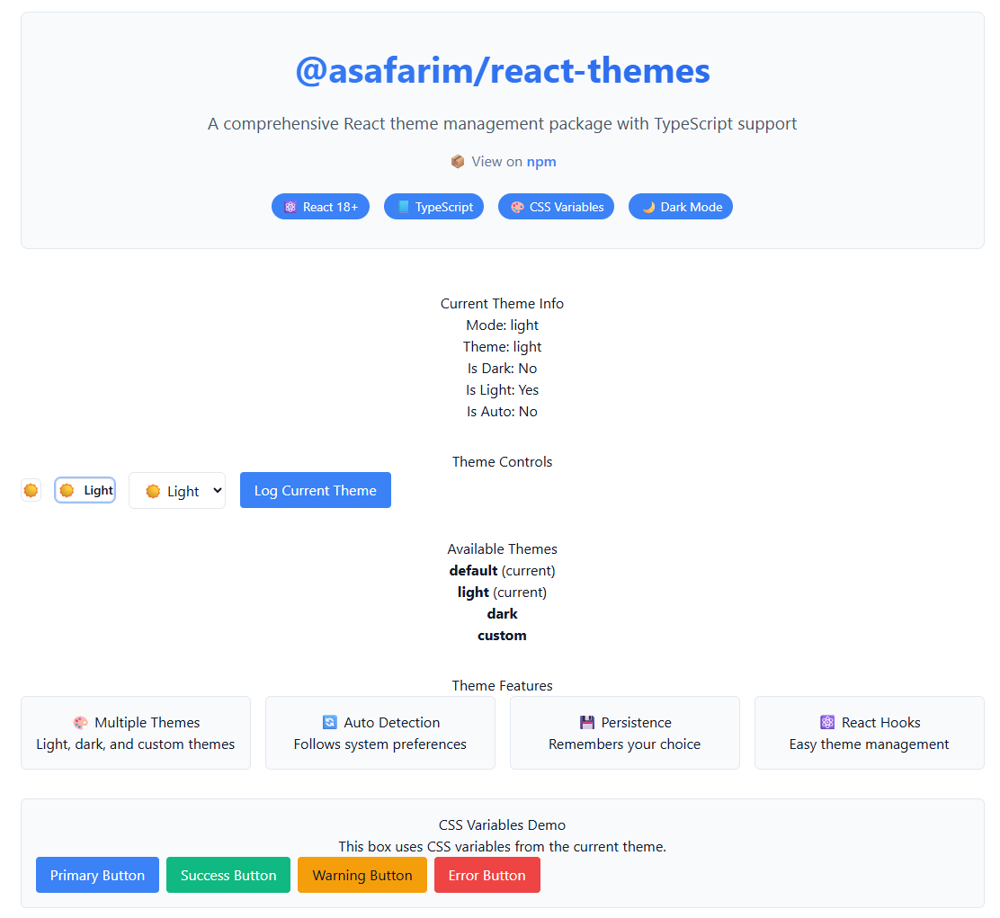
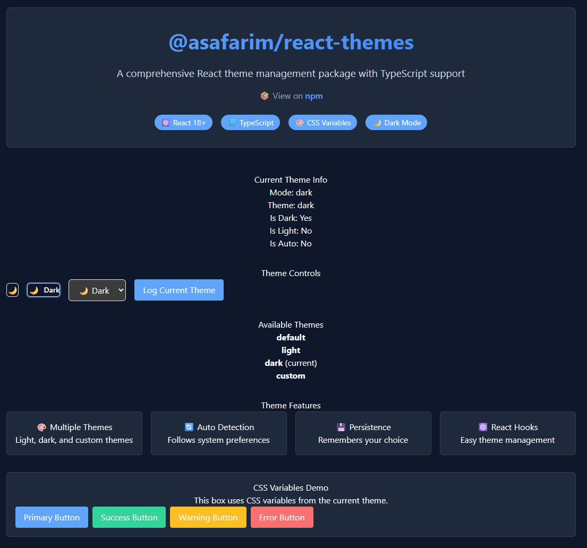

$ @"
# @asafarim/react-themes

A comprehensive theme management system for React applications with automatic dark/light mode detection, custom theme creation, and smooth transitions.

## 📸 Preview

Experience the theme system in action with our Live Interactive Demo:

- https://alisafari-it.github.io/react-themes/

### 🎯 Demo Showcases

The live demo demonstrates all package capabilities:

- 🎨 Theme Switching: Real-time theme transitions between light, dark, and auto modes
- 🔧 Component Gallery: All built-in components (ThemeToggle, ThemeSelector) in action
- 📱 Responsive Design: How themes adapt across different screen sizes
- 🎪 CSS Variables: Live CSS variable updates and their effects
- ⚡ Performance: Smooth animations and transitions
- ♿ Accessibility: Keyboard navigation and screen reader support

<table>
  <tr>
    <td align="center">
      
       
      <em>Light Theme — Clean and Modern</em>
    </td>
    <td align="center">
      
       
      <em>Dark Theme — Elegant and Eye‑friendly</em>
    </td>
  </tr>
</table>

### 🚀 Try It Live

Visit https://alisafari-it.github.io/react-themes/ to:

1. Interactive Testing: Toggle between themes and see instant changes
2. Code Examples: View implementation examples for each feature
3. Performance Metrics: See how fast theme switching works
4. Integration Examples: Real-world usage with other components
5. Customization Demo: Examples of custom theme creation
6. Browser Compatibility: Test across different browsers and devices

## ✨ Features

### 🌓 Smart Theme Management

- Auto Detection: Follows system dark/light mode preferences
- Manual Override: Users can manually select their preferred theme mode
- Persistence: Remembers user choice across sessions (localStorage)
- Real-time Updates: Instantly responds to system theme changes

### 🎨 Advanced Theming System

- Built-in Themes: Professionally designed light and dark themes
- Custom Themes: Create unlimited custom themes with full control
- Theme Merging: Easily extend existing themes with custom properties
- CSS Variables: Automatic injection of CSS custom properties

### ⚡ Performance & UX

- Smooth Transitions: Beautiful transitions between theme changes
- Zero Flicker: Prevents flash of unstyled content during init
- Lightweight: Minimal bundle size impact (~8KB gzipped)
- Tree-shakeable: Import only what you need

### 🔧 Developer Experience

- TypeScript First: Full type definitions
- React 18-ready: Works with React 16.8+ (Hooks) and optimized for React 18
- Hooks API: Intuitive React hooks for theme management
- Components: Pre-built, accessible components for common use cases

### 🎯 Integration & Compatibility

- Framework Agnostic: Next.js, Gatsby, CRA, Vite, etc.
- CSS-in-JS Compatible: styled-components, emotion, etc.
- Tailwind Ready: Use via CSS variables
- SSR Support: Hydration-safe with sensible fallbacks

### ♿ Accessibility

- WCAG Friendly: High contrast, readable defaults
- Keyboard Navigation: Full keyboard support
- Screen Reader Support: Proper ARIA labels
- Reduced Motion: Respects user preferences

## 📦 Installation

~~~bash
npm install @asafarim/react-themes
# or
yarn add @asafarim/react-themes
# or
pnpm add @asafarim/react-themes
~~~

## 🚀 Quick Start

### 1) Wrap your app with ThemeProvider

~~~tsx
import React from 'react';
import { ThemeProvider } from '@asafarim/react-themes';
import '@asafarim/react-themes/styles.css'; // Optional base styles

function App() {
  return (
    <ThemeProvider defaultMode="auto" persistMode={true}>
      <YourAppContent />
    </ThemeProvider>
  );
}
~~~

### 2) Use the theme in your components

~~~tsx
import React from 'react';
import { useTheme, ThemeToggle } from '@asafarim/react-themes';

function MyComponent() {
  const { mode, currentTheme } = useTheme();

  return (
    

      <h1>Current mode: {mode}</h1>
      <ThemeToggle />
    

  );
}
~~~

## 🎯 Use Cases & Examples

### 📚 Real-World Applications

See the demo for these practical implementations:

#### 🌐 Web Applications

~~~tsx
// E-commerce dashboard with theme switching
import { ThemeProvider, ThemeToggle } from '@asafarim/react-themes';

function EcommerceDashboard() {
  return (
    <ThemeProvider defaultMode="auto" persistMode={true}>
      <header className="dashboard-header">
        <h1>Sales Dashboard</h1>
        <ThemeToggle size="sm" showLabels={true} />
      </header>
      <main className="dashboard-content">{/* ... */}</main>
    </ThemeProvider>
  );
}
~~~

#### 📱 Mobile-First Design

~~~css
/* Responsive design that adapts to theme */
.mobile-card {
  background: var(--theme-color-background-secondary);
  border: 1px solid var(--theme-color-border);
  padding: var(--theme-spacing-md);
  border-radius: var(--theme-radius-lg);
  box-shadow: var(--theme-color-shadow, 0 1px 3px 0 rgba(0, 0, 0, 0.1));
  transition: var(--theme-transition-normal);
}
~~~

#### 🎨 Design Systems

~~~tsx
// Integration with component libraries
import { Button, Card } from 'your-ui-library';
import { useTheme } from '@asafarim/react-themes';

function ThemedComponents() {
  const { currentTheme } = useTheme();
  return (
    <Card style={{ backgroundColor: currentTheme.colors.background, color: currentTheme.colors.text }}>
      <Button variant={currentTheme.mode === 'dark' ? 'outlined' : 'filled'}>
        Themed Button
      </Button>
    </Card>
  );
}
~~~

### 🔄 Advanced Patterns

#### 🎪 Dynamic Theme Loading

~~~tsx
import { createTheme, useTheme } from '@asafarim/react-themes';

function DynamicThemeLoader() {
  const { setTheme } = useTheme();
  const loadUserTheme = async (userId: string) => {
    const resp = await fetch(`/api/users/${userId}/theme`);
    const themeData = await resp.json();
    const customTheme = createTheme(lightTheme, themeData);
    setTheme(customTheme);
  };
  return 
Loading personalized theme...
;
}
~~~

#### 🏢 Multi-Brand Applications

~~~tsx
const brandThemes = {
  corporate: createTheme(lightTheme, { name: 'corporate', colors: { primary: '#0066cc', secondary: '#004499' } }),
  creative: createTheme(darkTheme, { name: 'creative', colors: { primary: '#ff6b6b', secondary: '#4ecdc4' } })
};

<ThemeProvider customThemes={{ ...brandThemes }}>
  <BrandSwitcher />
</ThemeProvider>
~~~

## 📖 API Reference

### 🏗️ ThemeProvider

Manages theme state and applies CSS variables throughout your app.

~~~tsx
interface ThemeProviderProps {
  children: ReactNode;
  defaultMode?: 'light' | 'dark' | 'auto';
  defaultTheme?: string; // 'default' | custom theme name
  persistMode?: boolean; // default: true
  storageKey?: string;   // default: 'asafarim-theme-mode'
  customThemes?: Record<string, Theme>;
}
~~~

- defaultMode: Initial mode on first load
- defaultTheme: Name of the default theme to use
- persistMode: Save user's mode to localStorage
- storageKey: Key used for persistence
- customThemes: Provide additional themes

### 🪝 useTheme Hook

~~~tsx
interface UseThemeReturn {
  currentTheme: Theme;
  mode: ThemeMode; // 'light' | 'dark' | 'auto'
  setMode: (mode: ThemeMode) => void;
  setTheme: (theme: Theme) => void;
  themes: Record<string, Theme>;
  toggleMode: () => void; // cycles light ↔ dark (auto flips to opposite of system)
}
~~~

### ⚡ useThemeToggle Hook

~~~tsx
interface UseThemeToggleReturn {
  mode: ThemeMode;
  setMode: (mode: ThemeMode) => void;
  toggleMode: () => void;
  isDark: boolean;
  isLight: boolean;
  isAuto: boolean;
  effectiveMode: 'light' | 'dark';
}
~~~

### Components

#### ThemeToggle

A pre-built theme toggle button with variants and icon customization.

~~~tsx
import { ThemeToggle } from '@asafarim/react-themes';
import { Sun, Moon } from 'lucide-react';

<ThemeToggle
  size="md"                 // 'sm' | 'md' | 'lg'
  showLabels={false}
  variant="default"         // 'default' | 'outline' | 'ghost' | 'link' | 'circle' | 'icon'
  ariaLabel="Toggle theme"
  lightIcon={<Sun />}
  darkIcon={<Moon />}
  className="custom-class"
  style={{ margin: '10px' }}
/>
~~~

#### ThemeSelector

A dropdown selector for theme modes.

~~~tsx
<ThemeSelector
  showLabels={true}
  className="custom-class"
  options={[
    { mode: 'light', label: 'Light', icon: '☀️' },
    { mode: 'dark', label: 'Dark', icon: '🌙' },
    { mode: 'auto', label: 'Auto', icon: '🌓' }
  ]}
/>
~~~

## 🎨 Custom Themes

~~~tsx
import { createTheme, lightTheme, ThemeProvider } from '@asafarim/react-themes';

const myCustomTheme = createTheme(lightTheme, {
  name: 'my-theme',
  colors: {
    primary: '#ff6b6b',
    primaryHover: '#ff5252',
    background: '#f8f9fa',
    text: '#212529'
  }
});

<ThemeProvider customThemes={{ 'my-theme': myCustomTheme }}>
  <App />
</ThemeProvider>
~~~

### Using CSS Variables

~~~css
.my-component {
  background-color: var(--theme-color-background);
  color: var(--theme-color-text);
  border: 1px solid var(--theme-color-border);
  border-radius: var(--theme-radius-md);
  padding: var(--theme-spacing-md);
  transition: all var(--theme-transition-normal);
}

.my-button {
  background-color: var(--theme-color-primary);
  color: white;
  font-size: var(--theme-font-size-sm);
}

.my-button:hover {
  background-color: var(--theme-color-primary-hover);
}
~~~

## 🎯 Integration with @asafarim/dd-menu

~~~tsx
import { DDMenu } from '@asafarim/dd-menu';
import { useTheme } from '@asafarim/react-themes';

function NavMenu() {
  const { mode } = useTheme();
  return (
    <DDMenu items={menuItems} theme={mode} variant="navbar" />
  );
}
~~~

## 🚀 Live Demo & Showcase

Experience all features at:

- https://alisafari-it.github.io/react-themes/

The demo highlights:

- Theme Gallery: Light, Dark, Auto, Custom Themes
- Component Showcase: ThemeToggle variants, ThemeSelector
- CSS Variables Live: Watch variables update in real time
- Accessibility: Keyboard, screen readers, reduced motion
- Mobile Optimizations: Touch-friendly controls and layouts

## 🔧 Advanced Usage

### Custom Theme Structure (partial)

~~~tsx
interface Theme {
  name: string;
  mode: 'light' | 'dark' | 'auto';
  colors: {
    background: string;
    backgroundSecondary: string;
    backgroundTertiary: string;
    text: string;
    textSecondary: string;
    textMuted: string;
    border: string;
    borderLight: string;
    borderHover: string;
    primary: string;
    primaryHover: string;
    primaryActive: string;
    hover: string;
    active: string;
    focus: string;
    shadow: string;
    shadowMd: string;
    shadowLg: string;
  };
  spacing: { xs: string; sm: string; md: string; lg: string; xl: string; '2xl': string; '3xl': string; '4xl': string };
  // ... typography, radius, transitions, zIndex
}
~~~

### Programmatic Theme Application

~~~tsx
import { applyTheme } from '@asafarim/react-themes';

applyTheme(customTheme, 'dark');
~~~

## 🌍 Browser Support

- Modern browsers with CSS custom properties support
- Chrome 49+
- Firefox 31+
- Safari 9.1+
- Edge 16+

## 🤝 Contributing

We welcome contributions! The project is open-source and actively maintained.

### 🛠️ Development Setup

~~~bash
git clone https://github.com/AliSafari-IT/react-themes.git
cd react-themes
pnpm install
pnpm build
# optional during development
pnpm dev
# quality
pnpm type-check
pnpm lint
~~~

### 🔬 Local Verification

~~~bash
# After build, you can quickly verify exports
node test-import.js
~~~

### 📋 Contribution Guidelines

- Follow TypeScript best practices
- Add tests (where applicable) for new features
- Update documentation and examples
- Ensure accessibility compliance
- Test across different browsers

## 📄 License

MIT License — see the [LICENSE](LICENSE) file for details.

## 🌟 Why Choose @asafarim/react-themes?

### ✅ Production Ready

- Used in production at ASafariM projects
- Tested across browsers and devices
- Optimized for performance and accessibility
- Regular updates and maintenance

### 🎯 Developer Focused

- Extensive TypeScript support
- Comprehensive documentation with live examples
- Active community support
- Regular feature updates

### 🚀 Modern Standards

- React 16.8+ (Hooks) and React 18 optimized
- CSS Custom Properties
- ES2020+ JavaScript features
- Modern bundling and tree-shaking support

## 🔗 Related Packages & Ecosystem

- [`@asafarim/dd-menu`](https://www.npmjs.com/package/@asafarim/dd-menu) — Elegant dropdown menu component with theme integration

## 📊 Project Stats

- 🏗️ Built with: TypeScript, React, CSS Custom Properties
- 📦 Bundle Size: ~8KB gzipped
- 🌍 Browser Support: Chrome 49+, Firefox 31+, Safari 9.1+, Edge 16+
- ⚡ Performance: Zero‑flicker theme switching, optimized re‑renders
- ♿ Accessibility: WCAG 2.1 AA-friendly

## 📝 Changelog

### v1.8.1 — Latest

- New: ThemeToggle variants (default, outline, ghost, link, circle, icon)
- New: Custom icon support via lucide-react (lightIcon/darkIcon)
- New: mergeThemes, mergeThemeColors, deepMergeThemes utilities
- Improved: TypeScript types and CSS variable coverage
- Improved: SSR behavior and localStorage persistence handling
- Docs: Unified demo links, updated examples

### v1.1.0

- Enhanced TypeScript definitions
- Improved performance and bundle size
- Added comprehensive demo showcase
- Extended browser compatibility
- New theme customization options

### v1.0.0 — Initial Release

- Core ThemeProvider functionality
- Auto mode detection with system preference sync
- CSS variable injection system
- Built-in components (ThemeToggle, ThemeSelector)
- TypeScript support with full type safety
- localStorage persistence with customizable keys

---

### 🌟 Experience the Future of React Theming

<a href="https://alisafari-it.github.io/react-themes">Try the Live Demo</a> · <a href="https://www.npmjs.com/package/@asafarim/react-themes">View on npm</a> · <a href="https://github.com/AliSafari-IT/react-themes">Source Code</a>

Made with ❤️ and ☕ by <a href="https://asafarim.com">ASafariM</a>

<em>Empowering developers to create beautiful, accessible, and user‑friendly themed applications</em>

"@ | Set-Content -Path README.md -Encoding UTF8